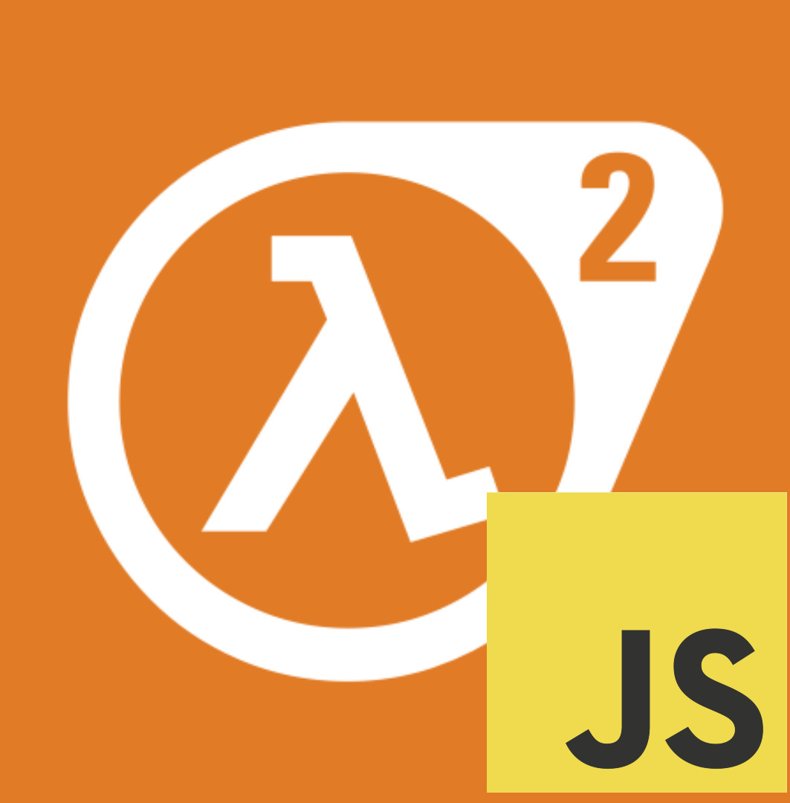

#  Half-Life 2: Javascript 

## Screenshot


## About & Features

**Half-Life 2: Javascript** is a port of the **Source 2013** engine branch for the browser.

Features:
- Emscripten toolset fully supported.
- Additional WebAssembly support on `gendbg.sh` and `makefile_base_posix.mak`.

Features planned:
- Source 2013 mod support: To allow modders to port their mods to this platform.
- Visual Studio 2022+ support.

## Upgrading mods to HL2JS
Firstly grab your mods source code, and make sure its running the `singleplayer` branch, and make sure that your modification uses `git`. To check the following run the following commands:

```
# Enter your mods directory for this to work
which git
ls -a | grep .git/
```

Now add HL2JS as a remote.

```
git remote add hl2js https://github.com/HalfLife2JS/HalfLife2JS
git merge hl2js/master --allow-unrelated-histories
```

Resolve any merge issues.
## Compiling

Firstly, make sure you have the dependencies required from the Valve Developer Wiki's page on building Source 2013 mods, alongside the Emscripten toolsets (emcc, em++, emar, etc).

Secondly, clone the repository with the following command:

```
git clone https://github.com/HalfLife2JS/HalfLife2JS hl2js
cd hl2js
```

Thirdly, enter the `src` directory, and compile it.

```
./creategameprojects
make -f everything.make
```
## FAQ

#### Will this support Source games running on other engine branches?

No, ASW and the branches after it will not be supported.

#### Will I be able to compile this with the latest Visual Studio and MSVC?

No. We don't have Visual Studio support yet. The only way which I know of to compile this on Windows is to either use `WSL2` or get the [VSExtForEmscripten](https://github.com/nokotan/VSExtForEmscripten) addon for Visual Studio 2017+


## Acknowledgements

 - [Emscripten](https://github.com/emscripten-core/emscripten): The project that made this project possible, and is the compiler that allows us to convert the Source Engine to WebAssembly.
 
 - [Xash3D FWGS](https://github.com/FWGS/xash3d-fwgs): A lot of inspiration from this project.
## Authors

[@vbsp-exe](https://www.github.com/vbsp-exe) is the  current author of this project.

Optionally, contributors can put their names inside the `AUTHORS` file and the `README`.


## Contributing

Contributions are always welcome!

See `contributing.md` for ways to get started.

